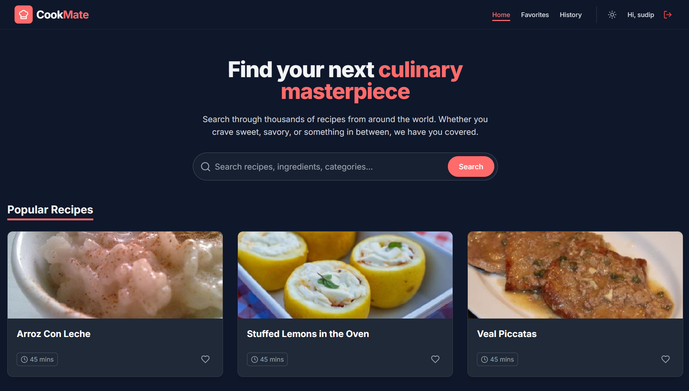

# **CookMate** 🍳  

> **Modern full-stack recipe discovery app** • React + Vite + Tailwind • Express + MongoDB • Spoonacular API • JWT Auth • Dark Mode

## 📸 **Screenshots**

| Home Page | Add more screenshots here |
|-----------|---------------------------|
|  |  |

---

## ✨ **Features**

| Feature | Description |
|---------|-------------|
| 🔍 **Recipe Search** | Real-time search by ingredients/categories via Spoonacular API |
| ❤️ **Favorites** | One-click save with rich metadata (title, image, time) |
| 📜 **History** | Auto-tracks viewed recipes for quick access |
| 🔐 **Auth** | JWT (httpOnly cookies
