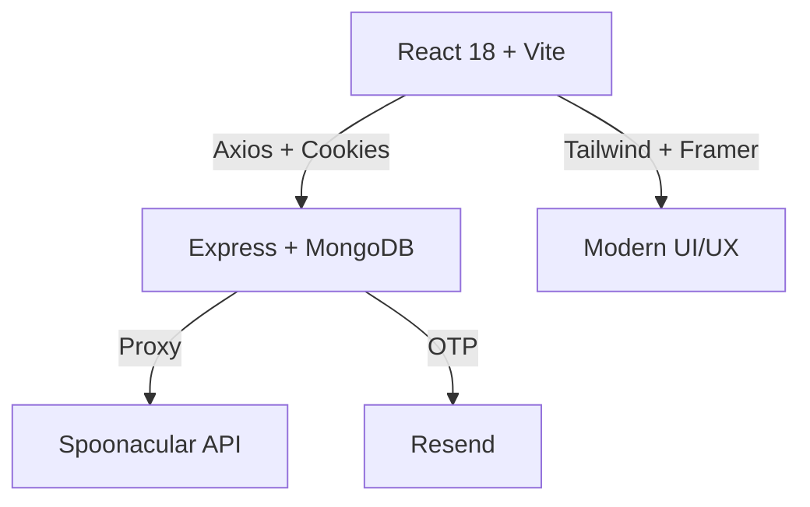

# **CookMate** 🍳 [](https://github.com/Sudip294/CookMate)

> **Modern full-stack recipe discovery app** • React + Vite + Tailwind • Express + MongoDB • Spoonacular API • JWT Auth • Dark Mode

[](https://cookmate-project.vercel.app) *[Deployed Demo]*

---

## ✨ **Features**

| Feature | Description |
|---------|-------------|
| 🔍 **Recipe Search** | Real-time search by ingredients/categories via Spoonacular API |
| ❤️ **Favorites** | One-click save with rich metadata (title, image, time) |
| 📜 **History** | Auto-tracks viewed recipes for quick access |
| 🔐 **Auth** | JWT (httpOnly cookies) + OTP reset via Resend |
| 🌙 **Dark Mode** | Theme toggle with smooth Framer Motion animations |
| 📱 **Responsive** | Mobile-first TailwindCSS design |

---

## 🛠️ **Tech Stack**



**Frontend**: React Router • TailwindCSS • Lucide Icons • React Hot Toast  
**Backend**: Mongoose • bcryptjs • jsonwebtoken • Nodemon  
**Deployment**: Vercel/Netlify (FE) • Render/Railway (BE)

---

## 📁 **Structure**

```
CookMate/
├── backend/                 # API Server
│   ├── src/
│   │   ├── controllers/    # Auth, User, Recipe logic
│   │   ├── models/User.js  # Embedded favorites/history
│   │   ├── routes/         # /api/auth*, /user*, /recipes*
│   │   └── server.js       # Port 5000
├── frontend/                # React SPA
│   ├── src/
│   │   ├── components/     # Navbar, RecipeCard, etc.
│   │   ├── context/        # Auth + Theme providers
│   │   └── pages/          # Home, Favorites, etc.
└── README.md
```

---

## 🚀 **Quick Start**

### Prerequisites
- [Node.js](https://nodejs.org/) 18+
- [MongoDB Atlas](https://mongodb.com/atlas)
- API Keys: [Spoonacular](https://spoonacular.com/food-api), [Resend](https://resend.com)

### 1. Clone & Install
```bash
git clone https://github.com/Sudip294/CookMate.git
cd CookMate
```

### 2. Backend
```bash
cd backend
npm install
# Copy .env.example → .env + add keys
npm run dev    # http://localhost:5000
```

### 3. Frontend (new terminal)
```bash
cd frontend
npm install
npm run dev    # http://localhost:5173
```

**Env Template** (`backend/.env`):
```env
PORT=5000
MONGO_URI=mongodb+srv://...
JWT_SECRET=supersecretkey
RESEND_API_KEY=...
SPOONACULAR_API_KEY=...
CLIENT_URL=http://localhost:5173
```

---

## 🔍 **API Endpoints**

| Method | Endpoint | Auth | Description |
|--------|----------|------|-------------|
| POST | `/api/auth/register` | - | Create account |
| POST | `/api/auth/login` | - | JWT login |
| GET | `/api/recipes/search` | - | Search recipes |
| POST | `/api/user/favorites` | ✓ | Add favorite |

[Full API Docs](https://github.com/Sudip294/CookMate/blob/main/backend/API.md)

---

## 🎨 **Design System**
- **Primary**: `#FF6B6B` (Coral)
- **Secondary**: `#4ECDC4` (Teal)
- **Dark**: `slate-900`
- Figma-ready, mobile-first, accessible

---

## 🤝 **Contributing**
1. Fork → Clone → Create `feat/xyz` branch
2. `npm run lint` • `npm test` (add tests!)
3. PR to `main` with changelog

---

⭐ **Star & share if helpful!**  
**Built with ❤️ by [Sudip294](https://github.com/Sudip294)**
